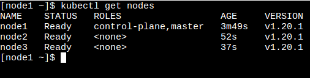
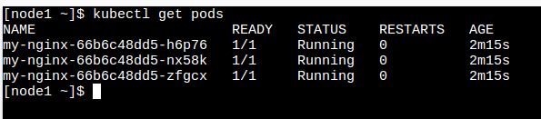

# kubernetes-cluster
This repo contains steps to create a simple Kubernetes cluster

* Login to https://labs.play-with-k8s.com
* Create 3 instances (1 Master, 2 Worker Nodes)
* Configure master (Choose any node and execute below command)
  ``` 
  kubeadm init --apiserver-advertise-address $(hostname -i)
  ```
* Run below commands to start using kubectl
  ```
  mkdir -p $HOME/.kube
  sudo cp -i /etc/kubernetes/admin.conf $HOME/.kube/config
  sudo chown $(id -u):$(id -g) $HOME/.kube/config
  ```
* Configure networking
  ```
  kubectl apply -n kube-system -f "https://cloud.weave.works/k8s/net?k8s-version=$(kubectl version | base64 |tr -d '\n')"
  ```
* Execute below command in each worker node to join the Kubernetes cluster
  ```
  kubeadm join 192.168.0.8:6443 --token lmnc8w.6v8mih12m2vmptr7 
             --discovery-token-ca-cert-hash sha256:dbeba2f61cc3c894b58fd7a063d020b2734b5c11d22421321a7bdd16266c06d7
  ```
             
* Now both the worker nodes joined Kubernetes cluster. Check it using command
  ```
  kubectl get nodes
  ```
  
   
* Deploy sample nginx application
  ```
  kubectl apply -f https://raw.githubusercontent.com/kubernetes/website/master/content/en/examples/application/nginx-app.yaml
  
  kubectl get pods
  ```
  
   
  


